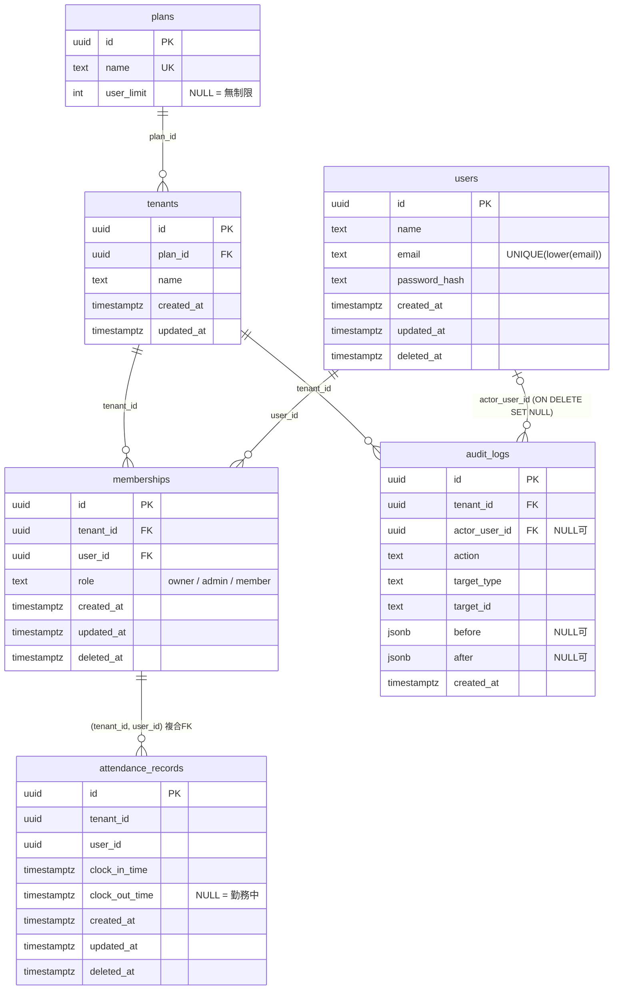

# マルチテナント勤怠管理 SaaS

マルチテナント SaaS に必要な要素（認証認可・テナント分離・RBAC・監査ログ・論理削除・マイグレーション）を、**最小構成で一通り触る**ことを目的にした学習用プロジェクトです。

- 技術スタック: Python / FastAPI / PostgreSQL 18 / SQLAlchemy 2.x / Alembic / Docker Compose
- 方針: 「機能の多さ」ではなく「設計判断を説明できること」を優先する
- このドキュメントは、**何を作ったか** だけでなく **なぜその設計にしたか** を残すためのものです

---

## 目次

1. [進捗](#1-進捗)
2. [スコープ](#2-スコープ)
3. [クイックスタート](#3-クイックスタート)
4. [ディレクトリ構成](#4-ディレクトリ構成)
5. [データベース設計](#5-データベース設計)
6. [API 設計](#6-api-設計)
7. [設計判断と理由](#7-設計判断と理由)
8. [マイグレーションの履歴と運用](#8-マイグレーションの履歴と運用)
9. [つまずきと対処（トラブルシューティング）](#9-つまずきと対処トラブルシューティング)
10. [既知の弱点・未対応事項](#10-既知の弱点未対応事項)
11. [今後の予定](#11-今後の予定)
12. [学んだことの要約](#12-学んだことの要約)

---

## 1. 進捗

| 項目 | 状態 |
|---|---|
| 設計（ER 図・API 一覧・ロール設計） | 完了 |
| 環境構築（Docker / PostgreSQL / Alembic） | 完了 |
| スキーマ（6 テーブル、制約、インデックス、seed） | 完了 |
| 認証: パスワードハッシュ化（argon2id） | 完了 |
| 認証: JWT の発行と検証 | 完了 |
| `POST /auth/signup`（テナント + ユーザー + owner を 1 トランザクション） | 完了 |
| `POST /auth/login` | 完了 |
| 認証依存関数（トークンから現在のユーザーを取得） | 未着手 |
| テナント分離・RBAC | 未着手 |
| 勤怠 API（打刻・一覧・修正） | 未着手 |
| メンバー管理 API・監査ログ閲覧 API | 未着手 |
| プラン制限 | 未着手 |
| 発展（Google ログイン / Stripe / RLS のいずれか 1 つ） | 未着手 |

---

## 2. スコープ

### 作るもの（MVP）

- テナント（会社）の登録と、ユーザーの追加・参加
- 出勤 / 退勤の打刻、自分の勤怠一覧
- 管理者によるメンバーの勤怠閲覧と修正
- 重要操作の監査ログ
- プラン（Free / Pro）によるユーザー数制限

### 作らないもの（意図的に切った）

給与計算、シフト管理、複雑な残業計算、有給管理、モバイルアプリ、通知機能。
理由: 学習目的の要素（認証認可・テナント分離・監査）に集中するため。

---

## 3. クイックスタート

### 必要なもの

- Docker / Docker Compose
- Python 3.11 以上（型注釈で `X | None` を使うため）

### 手順

```bash
# 1. リポジトリを取得
git clone <このリポジトリのURL>
cd attendance-management

# 2. 環境変数ファイルを作る
cp .env.example .env
#    → .env を開き、POSTGRES_PASSWORD と SECRET_KEY を必ず変更する（下記）

# 3. DB を起動する
docker compose up -d
docker compose ps          # STATUS が healthy になるまで待つ

# 4. Python 環境を作る
python -m venv .venv
.venv\Scripts\Activate.ps1      # Windows (PowerShell)
# source .venv/bin/activate     # macOS / Linux
pip install -r requirements.txt

# 5. テーブルを作る（初期データの free / pro プランも入る）
alembic upgrade head

# 6. API を起動する
uvicorn app.main:app --reload
```

起動後、`http://localhost:8000/docs`（Swagger UI）から API を試せます。

### 環境変数（`.env`）

| 変数 | 内容 | 備考 |
|---|---|---|
| `POSTGRES_USER` | DB ユーザー名 | |
| `POSTGRES_PASSWORD` | DB パスワード | **必ず変更する**。`.env.example` の値は見本 |
| `POSTGRES_DB` | DB 名 | |
| `POSTGRES_HOST` | DB のホスト | PC の Python から接続するなら `localhost`。将来アプリもコンテナ化したら、サービス名 `db` |
| `POSTGRES_PORT` | **PC 側**のポート | 既に PostgreSQL が動いている場合は `5433` などに変更する。コンテナ内は常に 5432 |
| `SECRET_KEY` | JWT の署名鍵 | **必ず変更する**。下記コマンドで生成 |
| `ALGORITHM` | JWT の署名方式 | `HS256` |
| `ACCESS_TOKEN_EXPIRE_MINUTES` | アクセストークンの有効期限（分） | 短いほど被害が小さい |

```bash
# SECRET_KEY の生成
python -c "import secrets; print(secrets.token_urlsafe(32))"
```

> **注意**: `.env` は Git に上げません（`.gitignore` 済み）。`.env.example` には**ダミー値だけ**を書きます。
> `.env` に項目を足したら、`.env.example` と `Settings` クラス（`app/config.py`）にも必ず足してください。3 か所が揃っていないと、起動時に `ValidationError` になります。

### 完全な作り直し（再現性の確認）

```bash
docker compose down -v      # コンテナとボリュームを削除（DB の中身は消える）
docker compose up -d
alembic upgrade head
```

---

## 4. ディレクトリ構成

```
attendance-management/
├── app/
│   ├── __init__.py
│   ├── config.py          # 設定を読む（Settings）。接続 URL の組み立ても持つ
│   ├── database.py        # engine / SessionLocal / get_db
│   ├── models.py          # SQLAlchemy のモデル（6 テーブル）
│   ├── schemas.py         # API の入出力（Pydantic）
│   ├── security.py        # パスワードハッシュ、JWT の発行・検証
│   ├── main.py            # FastAPI アプリ本体
│   └── routers/
│       ├── __init__.py
│       └── auth.py        # /auth/signup, /auth/login
├── migrations/            # Alembic（env.py は settings.url から接続先を取る）
│   └── versions/
├── scripts/
│   └── check_db.py        # DB 接続の確認用スクリプト
├── alembic.ini
├── docker-compose.yml
├── requirements.txt
├── .env.example
└── .gitignore
```

### ファイルを分けた理由

- **`config.py`（設定）と `database.py`（engine）を分ける**
  Alembic が欲しいのは接続 URL だけで、engine まで作られると余計です。`config.py` は設定を読むだけにして、他のどこからでも安全に import できるようにしました。変更の理由が別（JWT 設定を足す / DB 構成を変える）という点でも、分けておく価値があります。
- **ORM のモデル（`models.py`）と Pydantic のスキーマ（`schemas.py`）を分ける**
  前者は DB のテーブルの表現、後者は API の入出力の形です。同じ名前（`User` など）で混在させると衝突するうえ、`password_hash` を持つクラスをレスポンスに使う事故につながります。

---

## 5. データベース設計

### ER 図



### 制約とインデックス

| テーブル | 制約・インデックス | 目的 |
|---|---|---|
| plans | `UNIQUE(name)` | プラン名の重複防止（`free` で検索するため） |
| plans | `CHECK (user_limit IS NULL OR user_limit > 0)` | 0 や負数の上限を防ぐ |
| users | `UNIQUE INDEX (lower(email))` | 大文字小文字違いの重複登録を防ぐ |
| memberships | `UNIQUE(tenant_id, user_id)` | 同じ人が同じテナントに二重所属しない。複合 FK の参照先にもなる |
| memberships | `CHECK (role IN ('member','admin','owner'))` | ロールの typo を DB で防ぐ |
| attendance_records | `FOREIGN KEY (tenant_id, user_id) REFERENCES memberships (tenant_id, user_id)` | 所属していない人の勤怠をDBが拒否する（テナント分離の最後の砦） |
| attendance_records | `UNIQUE INDEX (tenant_id, user_id) WHERE clock_out_time IS NULL AND deleted_at IS NULL` | 二重出勤（退勤前の行が 2 つ）を防ぐ |
| attendance_records | `CHECK (clock_out_time IS NULL OR clock_out_time > clock_in_time)` | 退勤が出勤より前、という矛盾を防ぐ |
| attendance_records | `INDEX (tenant_id, user_id, clock_in_time)` | 「あるテナントの、あるユーザーの、月別勤怠」の範囲検索 |
| audit_logs | `INDEX (tenant_id, created_at DESC)` | 最近の操作一覧 |
| audit_logs | `INDEX (tenant_id, target_type, target_id)` | 「このレコードの履歴」 |

### 初期データ（マイグレーションで投入）

| name | user_limit |
|---|---|
| `free` | 5 |
| `pro` | NULL（無制限） |

---

## 6. API 設計

テナントの特定は **パスに含める**（`/tenants/{tenant_id}/...`）方式です。

「必要ロール」は **そのロール以上**（`member` なら member / admin / owner 全員が可）を意味します。

| メソッド + パス | 必要ロール | 監査ログ | 実装状況 |
|---|---|---|---|
| `POST /auth/signup` | なし | 記録（`tenant.create`） | 実装済み |
| `POST /auth/login` | なし | 記録しない | 実装済み |
| `POST /tenants/{tenant_id}/attendance/clock-in` | member | 記録しない | 未実装 |
| `POST /tenants/{tenant_id}/attendance/clock-out` | member | 記録しない | 未実装 |
| `GET  /tenants/{tenant_id}/attendance/me` | member | 記録しない | 未実装 |
| `GET  /tenants/{tenant_id}/members` | member | 記録しない | 未実装 |
| `POST /tenants/{tenant_id}/members` | admin | 記録 | 未実装 |
| `DELETE /tenants/{tenant_id}/members/{user_id}` | admin（対象は member のみ。owner は全員可、最後の owner は不可） | 記録 | 未実装 |
| `PATCH /tenants/{tenant_id}/members/{user_id}/role` | owner | 記録 | 未実装 |
| `GET  /tenants/{tenant_id}/members/{user_id}/attendance` | owner | 記録しない | 未実装 |
| `PATCH /tenants/{tenant_id}/attendance/{record_id}` | owner | 記録 | 未実装 |
| `GET  /tenants/{tenant_id}/audit-logs` | admin | 記録しない | 未実装 |

### ロールの権限の考え方

**判断の軸: 取り消しがつかない操作、お金、権限の頂点に関わることは owner だけ。**

| 操作する人 \ 対象 | member | admin | owner |
|---|---|---|---|
| owner | できる | できる | できる（ただし最後の 1 人は不可） |
| admin | できる | できない | できない |

- owner が 1 人しかいないときは、その owner を削除も降格もできない。先に別の owner を作る
- 削除と降格の**両方**で、同じ「最後の owner」チェックを通す
- 他人の勤怠は個人情報に近いので、閲覧も修正も owner のみ（「見る権限」が「直す権限」より狭くならないように揃えた）

### エラーの使い分け

| 状況 | ステータス | 理由 |
|---|---|---|
| そのテナントのメンバーではない | 403 | テナントの存在有無を教えない。403 に統一 |
| メンバーだが、対象のレコードが存在しない / 別テナントのもの | 404 | 自分のテナント内の話なので隠す必要はない。「存在しない」と「別テナント」を区別させない |
| 認証失敗（ログイン） | 401 + `WWW-Authenticate: Bearer` | |
| メール重複（サインアップ） | 409 | |

---

## 7. 設計判断と理由

面接で説明できるよう、**判断・選択肢・理由**の順に書きます。

### 7.1 テナントの特定: パスに含める

- 選択肢: パス / ヘッダー（`X-Tenant-Id`）/ JWT に「現在のテナント」を入れる
- 採用: **パス**
- 理由:
  - テナントが必須であることが URL から一目で分かり、付け忘れが構造的に起きにくい
  - ログから追いやすい
  - 複数テナントに所属するユーザーが、トークンを再発行せずに切り替えられる
- どの方式でも、**クライアントから来た値は信用せず、サーバー側で「このユーザーはこのテナントの有効なメンバーか」を毎回検証する**

### 7.2 ユーザーとテナントの関係: 多対多（`memberships`）

- `users.tenant_id` にすると「1 ユーザー = 1 テナント」になり、同じ人が A 社と B 社の両方に所属できない
- **所属という事実を持つ中間テーブル `memberships`** を置き、ロールもここに持たせる
- 理由: A さんは A 社では owner、B 社では member、ということがありえるため。ロールは「人」ではなく「所属」の属性

### 7.3 招待は「既存ユーザーを直接追加」

- 選択肢: 既存ユーザーのメール指定で追加（未登録なら失敗）/ 招待トークンを発行して相手が承認
- 採用: 前者
- 理由: 後者は `invitations` テーブルと画面が増え、7 日の枠に収まらないため。拡張案に回した

### 7.4 勤怠は `memberships` への複合外部キー

- 通常の FK を `users` と `tenants` に別々に張ると、「A 社 × B さん」（A 社にいない人）の勤怠が入ってしまう
- `(tenant_id, user_id)` の**組み合わせ**が `memberships` にあることを、DB が保証する
- アプリの検証をすり抜けたバグがあっても、DB が最後の砦になる（アプリ層 + DB 層の二重防御）
- **限界**: 複合 FK は「`memberships` に行があるか」しか見ない。論理削除（`deleted_at` セット）された所属の行も通ってしまうので、**`deleted_at IS NULL` の確認はアプリ側の責務**

### 7.5 二重出勤は部分ユニークインデックスで防ぐ

- 出勤 = INSERT（`clock_out_time` は NULL）、退勤 = 退勤前の行を UPDATE
- 「退勤前の行は 1 ユーザー 1 件まで」を、`WHERE clock_out_time IS NULL AND deleted_at IS NULL` 付きのユニークインデックスで保証する
- 「先に SELECT して確認する」方式では、**同時に 2 回押されたときにすり抜ける**。DB の制約なら確実
- `deleted_at IS NULL` を条件に入れる理由: 誤打刻を論理削除したあと、同じ人が再度出勤できるようにするため

### 7.6 監査ログ

- **追記のみ**（`updated_at` / `deleted_at` を持たない）。書き換えられるログは証拠にならない
- `(target_type, target_id)` を文字列のペアで持つ。対象テーブルごとに外部キーのカラムを作ると、テーブルが増えるたびに破綻する
- 変更前後は `jsonb`（`before` / `after`）。CREATE 時は `before` が NULL、DELETE 時は `after` が NULL
- `none_as_null=True`: SQLAlchemy の既定では Python の `None` が **JSON の `null`** になり、`WHERE before IS NULL` で検索できない。SQL の NULL として保存する設定にした
- `actor_user_id` は `ON DELETE SET NULL`、かつ NULL 可。ユーザーが消えてもログは残す
- **`memberships` への複合 FK にはしない**。所属を外された人の過去ログが見えなくなるのを避けるため
- **パスワードやハッシュはログに入れない**。メールアドレスも入れず、`user_id` だけにした（監査ログは長く残るため、個人情報を持ち続けない）
- 本体の変更と**同じトランザクション**に入れる（本体は成功してログは失敗、を防ぐ）

記録する操作の基準: 「あとで誰かに『誰がやったの?』と聞かれうる操作か」。

- 記録する: テナント作成、メンバーの追加・削除、ロール変更、勤怠の修正
- 記録しない: ログイン（テナントに紐づかない操作）、本人の打刻（記録は `attendance_records` 自体に残る。事件になるのは管理者による修正のほう）

### 7.7 論理削除

- `users` / `memberships` / `attendance_records` に `deleted_at`
- メンバーを外す操作は `memberships.deleted_at` をセットする論理削除。複合 FK があるため、物理削除すると過去の勤怠が参照できなくなる
- 再招待は INSERT ではなく `deleted_at = NULL` に戻す（`UNIQUE(tenant_id, user_id)` があるため）
- ユーザー数上限のカウントは `deleted_at IS NULL` の所属だけを数える
- SQL の `IS NULL` は、SQLAlchemy では `.is_(None)` と書く（Python の `is None` は SQL の条件にならない）

### 7.8 プランと制限値

- 「Free/Pro の定義」（`plans`）と「このテナントがどのプランか」（`tenants.plan_id`）は別の情報
- `plans.user_limit` の NULL = 無制限。チェックは `limit is None or count < limit`
- `tenants.plan_id` は NOT NULL。サインアップ時に `name = 'free'` を引いて設定する（DB の `DEFAULT` にサブクエリは書けないため、アプリ側の責務）

### 7.9 認証: argon2id + JWT（アクセストークンのみ）

- **パスワード**: argon2id（`pwdlib`）。bcrypt より GPU/ASIC 攻撃への耐性が高い（メモリハード）。パスワード長の制限もほぼない。パラメータはライブラリの既定値
- **ハッシュ文字列にはソルトとパラメータが含まれる**。そのため `password_hash` 列は 1 つの `text` で足り、同じパスワードでも毎回違うハッシュになるのに検証できる
- **JWT かセッションか**: JWT を採用
  - 記事などで言われる「サーバー複数台・サーバーレス」という理由ではなく、API 中心の構成で扱いやすく、Swagger から試しやすいため
  - 正直に書くと、1 台構成ならセッションも有力
- **トークンに入れるのは `sub`（ユーザー ID）と `exp` だけ**。ロールや所属テナントは入れず、**毎回 DB の `memberships` で確認する**
  - 理由: ロールを入れると、降格後もトークンの期限まで古いロールが使えてしまう
- **JWT の弱点**: 発行済みトークンは期限まで取り消せない。退会やパスワード漏洩の際は、有効期限を短くすることで被害を抑える（リフレッシュトークン方式への拡張は将来の課題）
- JWT のペイロードは**暗号化されていない**（署名されているだけ）ので、機密情報は入れない
- `decode_access_token` は、トークンの不正をすべて `jwt.InvalidTokenError` に揃えて**例外として投げる**。`None` や例外オブジェクトを「返す」方式だと、呼び出し側のチェック漏れで不正なトークンが素通しされる
- `exp` と `sub` を必須（`options={"require": [...]}`）にし、`algorithms` はリストで明示する

### 7.10 サインアップ: 1 トランザクション

処理の流れ:

1. `plans` から `free` を引く（見つからなければサーバー側の準備不足なので 500）
2. `Tenant` と `User` を作って `add_all`
3. **`flush()`**: `id` は DB の `gen_random_uuid()` が作るため、`add` の時点では `None`。`flush` で INSERT を送り、`id` を受け取る（**確定ではない**ので、失敗すれば巻き戻せる）
4. `Membership(role="owner")` と監査ログ（`tenant.create`）を `add`
5. **`commit()` は最後に 1 回だけ**

その他の判断:

- **メール重複は、事前の SELECT ではなく DB の制約で検出する**。SELECT 方式は同時リクエストですり抜ける。`IntegrityError` を捕まえ、制約名（`users_email_lower_uq`）で判別して 409 にし、**他の制約違反は握りつぶさず投げ直す**
- メールは保存前に小文字にそろえる（`lower(email)` の一意制約と揃え、ログインの検索も単純になる）
- レスポンスは専用スキーマ（`SignupResponse`）で、`password_hash` を含めない
- `commit()` の前にレスポンスの値を変数に取っておく。`expire_on_commit` が `True`（既定）だと、`commit()` のあとの読み取りで追加の `SELECT` が走るため
- `commit()` は `get_db` ではなく **API の関数の中で明示的に呼ぶ**。確定のタイミングがコードに見え、監査ログを本体と同じトランザクションに入れやすい

### 7.11 ログイン

- 「メールが存在しない」と「パスワードが違う」を、**同じ 401・同じメッセージ**にする。違いを返すと、そのメールが登録されているかを第三者に教えてしまう（サインアップの 409 とは逆の考え方）
- 論理削除されたユーザー（`deleted_at IS NOT NULL`）はログインできない
- メールは小文字にして検索する

### 7.12 設定の一元管理

- `.env` → `pydantic-settings`（`Settings`）→ 接続 URL、という 1 本の経路にする。部品（`POSTGRES_*`）から URL を組み立てるので、1 か所を変えれば全部が変わる（Single Source of Truth）
- 接続 URL は `Settings.url`（`@property`）で、`URL.create` を使って組み立てる。文字列連結だと、パスワードに `@` `/` `:` が含まれたときに URL が壊れる
- `pydantic-settings` を選んだ理由: ポート番号を `int` で扱える。`.env` の項目漏れを**起動時に**エラーで検知できる（`os.getenv` だと使う時点で初めて `None` で失敗する）
- Alembic の `env.py` も `settings.url` を使い、`alembic.ini` の `sqlalchemy.url` はダミーのまま（秘密情報を ini に書かない）。マイグレーション用の engine は単発処理なので `NullPool`

### 7.13 Docker Compose

- イメージは `postgres:18.6` と**バージョンを固定**（`latest` は実行のたびに中身が変わりうるため、再現性が崩れる）
- 値は `${POSTGRES_USER}` などで `.env` から読む
- ポートは `"${POSTGRES_PORT}:5432"`。**左が PC 側、右がコンテナ側**。右は変えない（コンテナ内の PostgreSQL は 5432 で待ち受けているため）
- `healthcheck` に `pg_isready` を使う。「プロセスが起動した」と「接続を受け付けられる」は別。`$$POSTGRES_USER` と書いて、compose に置換させずコンテナ内の環境変数を使う
- `container_name` は固定しない（複数プロジェクトを並行して動かすと衝突する）
- **設計図は `docker-compose.yml`、データはボリューム**。コンテナを消してもデータはボリュームに残る

---

## 8. マイグレーションの履歴と運用

### 履歴

| 順 | 内容 | 種類 |
|---|---|---|
| 1 | `plans`, `tenants` の作成 | 構造 |
| 2 | `users`, `memberships` の作成（`lower(email)` の一意インデックス、CHECK、UNIQUE を含む） | 構造 |
| 3 | `plans` の seed（`free` = 5, `pro` = NULL） | データ |
| 4 | `attendance_records` の作成（複合 FK、部分ユニークインデックス、CHECK を含む） | 構造 |
| 5 | `audit_logs` の作成（降順インデックス、`ON DELETE SET NULL` を含む） | 構造 |

### 運用ルール

- **自動生成（`--autogenerate`）の結果は、必ず目で読んで設計と照らす**。部分インデックス、複合 FK、CHECK 制約は、モデルの書き方次第で拾われないことがある
- 生成ファイルに**関係ない変更が混ざっていたら、モデルと DB がずれている合図**
- seed のように構造が変わらないものは、`--autogenerate` を付けずに空のマイグレーションを作り、`upgrade()` / `downgrade()` を自分で書く
- マイグレーションの中では、`models.py` のクラスではなく、`sa.table()` / `sa.column()` による**簡易定義**を使う（モデルが後で変わっても、昔のマイグレーションが動き続けるように）
- **適用前のマイグレーションは書き換えてよいが、適用済みのものは書き換えない**。適用済みなら「`address` を削除する」のような新しいマイグレーションを追加する（実際、1 本目で `address` を後から削除した際、適用前だったので作り直した）
- `downgrade()` は、データが入った状態では失敗しうる。例: テナントが `free` を参照していると、seed の `DELETE` が外部キー違反で止まる。**往復（`upgrade head` → `downgrade -1` → `upgrade head`）を試して、動くことを確認する**

---

## 9. つまずきと対処（トラブルシューティング）

| 症状 | 原因 | 対処 |
|---|---|---|
| `password authentication failed for user "user"` | `POSTGRES_PASSWORD` は**ボリュームが空の初回起動時にしか使われない**。`.env` のパスワードを変えても、既存ボリュームの DB には反映されない | `docker compose down -v` でボリュームごと消して作り直す（DB の中身は消える） |
| `docker compose exec` で入れたのに Python から接続できない | コンテナ内からの `psql` はパスワードを聞かれない設定。「入れた」≠「パスワードが合っている」 | `.env` と DB の初期値を揃える。5432 を使うローカルの PostgreSQL がないかも確認する |
| データが `down` で消える / 起動に失敗する | **PostgreSQL 18 以降は、マウント先が `/var/lib/postgresql` に変わった**（`PGDATA` がバージョン固有になった）。`/var/lib/postgresql/data` にマウントすると、データが別の匿名ボリュームに入る | `pgdata:/var/lib/postgresql` にマウントする。17 以前は `/var/lib/postgresql/data` |
| `ModuleNotFoundError: No module named 'app'` | `python scripts/xxx.py` で実行している | プロジェクト直下から `python -m scripts.check_db` の形で実行する |
| `attempted relative import beyond top-level package` | 相対インポート（`..`）は、パッケージの内側でしか使えない | `app` から書き始める絶対インポートにする |
| `ValidationError`（起動時） | `.env` と `Settings` の項目が揃っていない | `.env`、`.env.example`、`Settings` の 3 か所を揃える |
| `ImportError: cannot import name 'settings'` | `Settings` クラスを定義しただけで、`settings = Settings()` を書いていない | `config.py` の末尾で作る |
| `Multiple head revisions are present` | `versions/` に起点が 2 つ（古いマイグレーションが残っている） | 未適用なら古いファイルを削除。適用済みなら `downgrade` するか DB を作り直す |
| 有効期限が 30 日になっていた | `timedelta(30)` の最初の引数は `days` | `timedelta(minutes=...)` と引数名を付ける |
| 削除済みユーザーでログインできた / 通常ユーザーがログインできない | `User.deleted_at is not None` は Python の式で、SQL の条件にならない。`.is_not(None)` は方向が逆 | `User.deleted_at.is_(None)`（`IS NULL`） |
| `UnknownHashError` | 検証に渡したハッシュ文字列が途中で切れていた（先頭の `$argon2id$` が欠けると、方式が判別できない） | ハッシュを手で貼らず、同じスクリプト内で作って検証する |
| JSON にできないエラー | `uuid.UUID` は JSON にならない | `after` や `target_id` に入れる値は `str(...)` に変換する |
| `unknown docker command: "compose db"` | `docker compose` の後にサブコマンド（`exec`）が必要 | `docker compose exec db psql -U <user> -d <db>` |

---

## 10. 既知の弱点・未対応事項

認識していて、意図的に後回しにしているものです。

### セキュリティ

- **ログインのタイミング攻撃**: 存在しないメールのときは argon2 の検証を飛ばして即座に失敗を返すため、応答時間の差から「そのメールは登録されている」と推測できる。対策（ダミーのハッシュに対して検証を 1 回走らせる）は未実装
- **JWT の失効**: 発行済みトークンは期限まで取り消せない。有効期限を短くすることで被害を抑える設計。リフレッシュトークンは未実装
- **ログイン API にレート制限がない**（総当たり攻撃への対策なし）
- **サインアップの 409 は、メールの登録有無を教える**。サインアップ時は利用者に重複を知らせる必要があるため許容しているが、ログインとは対照的な判断

### 整合性・設計

- **`updated_at` は自動更新されない**。`DEFAULT now()` は INSERT のときだけ効く。`onupdate` かトリガーで対応する（勤怠修正の実装前に決める）
- **「最後の owner」チェックの同時実行問題**: owner が 2 人いて、同時に互いを削除すると、両方がチェックを通って owner が 0 人になりうる。トランザクションと行ロックで対応する（Day 3〜5 の題材）
- **複合 FK は論理削除された所属を弾かない**（7.4 参照）。打刻 API で `memberships.deleted_at IS NULL` を確認する必要がある
- **ロールの文字列が 3 か所に散らばっている**（`models.py` の CHECK、`schemas.py` の `Literal`、`auth.py` の `"owner"`）。`Enum` か定数に集約する
- 退勤を押し忘れた翌日は、部分ユニークインデックスにより出勤できなくなる。管理者による修正か自動処理かの仕様判断が必要

### 小さな修正（未対応）

- `signup` の `e.orig.diag.constraint_name` を、`getattr` で安全に読む（`diag` に制約名が入らない違反がありうる）
- `free` プランが見つからないとき、クライアントには一般的な文だけ返しているが、**サーバー側のログに原因が残らない**（`logging` で残す）
- `LoginRequest.password` にも `min_length=8` が付いている。ログインでは入力の長さを検証する必要は薄く、パスワードポリシーを漏らす面もあるため、見直し候補
- `SignupRequest` の `tenant_name` / `user_name` に、空文字を拒否する設定がない

---

## 11. 今後の予定

| 日 | 内容 |
|---|---|
| 認証の続き | トークンから「現在のユーザー」を取り出す依存関数。保護された API を 1 本作って確認する |
| Day 3 | テナント分離と RBAC（**このプロジェクトの核心**）。「今どのテナントか」の確定、テナントを絞り忘れない仕組み、ロールによる認可、**他テナントのデータが見えないことを確認するテスト** |
| Day 4 | 勤怠機能（出勤・退勤、二重打刻・退勤忘れ、自分の勤怠一覧、月次集計、管理者による修正、論理削除） |
| Day 5 | 監査ログの組み込み、プラン別のユーザー数制限、スキーマ変更のマイグレーション演習（既存データがある状態で） |
| Day 6 | 発展（A: Google ログイン / B: Stripe テストモード / C: PostgreSQL の Row Level Security でテナント分離を二重化）のうち 1 つ |
| Day 7 | 仕上げ（この README、API ドキュメント、振り返り） |

### 完成の定義

- [ ] テナント A のユーザーがテナント B のデータに触れないことが、テストで証明されている
- [ ] ロールごとに操作可否が変わる
- [ ] 重要操作が監査ログに残る
- [ ] マイグレーションで、一から環境を再現できる
- [ ] README に「なぜその設計にしたか」が書かれている

---

## 12. 学んだことの要約

### DB 設計

- カラムは「画面や API で何をしたいか」から逆算して決める。「あとで使うかも」は入れない
- 「1 行は何を表すか」を一文で言えないテーブルは、設計が曖昧
- 制約（UNIQUE / CHECK / 複合 FK / 部分インデックス）は、アプリの検証をすり抜けたときの最後の砦
- インデックスは、実際に使う検索にだけ張る。複合インデックスは「等しい条件 → 範囲条件」の順（左端ルール）。外部キーには自動でインデックスが作られない

### SQLAlchemy / Alembic

- `Base.metadata` は「テーブル定義の名簿」。Alembic はこれと現在の DB を比べて差分を作る
- `add` は登録、`flush` は SQL を送る（未確定）、`commit` は確定
- SQLAlchemy 2.x は、`commit()` を呼ばずに接続を閉じると `ROLLBACK` になる
- 型注釈が DDL になる: `Mapped[str]` は NOT NULL、`Mapped[str | None]` は NULL 可
- `expire_on_commit=True` では、`commit()` のあとの読み取りで再 `SELECT` が走る

### 認証

- パスワードは平文で保存せず、ソルト入りのハッシュにする
- 認証の失敗は、**例外として投げる**。戻り値で返すと、チェック漏れで素通しされる
- 認証失敗のメッセージは、失敗の種類を区別させない

### 運用・公開

- `.env` は上げない。見本の `.env.example` には「必ず変えて」と分かるダミー値を書く
- 秘密情報は、一度コミットすると履歴に残る
- **「できた」と「動く」は別**。制約は、実際に壊そうとして、エラーになることを確認する