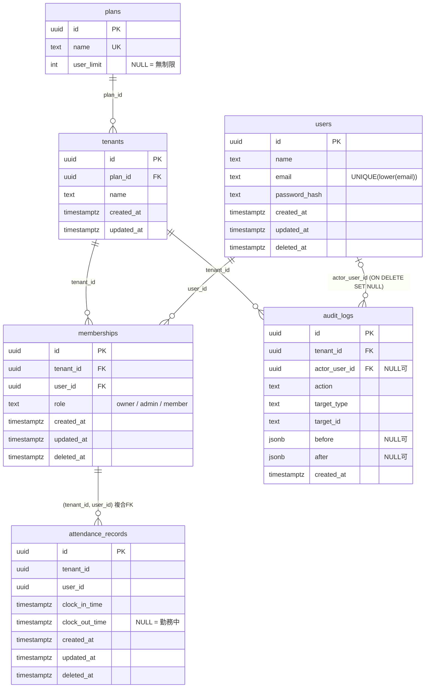

# マルチテナント勤怠管理 SaaS

マルチテナント SaaS に必要な要素（認証認可・テナント分離・RBAC・監査ログ・論理削除・マイグレーション）を、**最小構成で一通り触る**ことを目的にした学習用プロジェクトです。

- 技術スタック: Python / FastAPI / PostgreSQL 18 / SQLAlchemy 2.x / Alembic / Docker Compose
- 方針: 「機能の多さ」ではなく「設計判断を説明できること」を優先する
- このドキュメントは、**何を作ったか** だけでなく **なぜその設計にしたか** を残すためのものです

---

## 目次

1. [進捗](#1-進捗)
2. [スコープ](#2-スコープ)
3. [クイックスタート](#3-クイックスタート)
4. [ディレクトリ構成](#4-ディレクトリ構成)
5. [データベース設計](#5-データベース設計)
6. [API 設計](#6-api-設計)
7. [設計判断と理由](#7-設計判断と理由)
8. [マイグレーションの履歴と運用](#8-マイグレーションの履歴と運用)
9. [テスト](#9-テスト)
10. [つまずきと対処（トラブルシューティング）](#10-つまずきと対処トラブルシューティング)
11. [既知の弱点・未対応事項](#11-既知の弱点未対応事項)
12. [今後の予定](#12-今後の予定)
13. [学んだことの要約](#13-学んだことの要約)

---

## 1. 進捗

| 項目 | 状態 |
|---|---|
| 設計（ER 図・API 一覧・ロール設計） | 完了 |
| 環境構築（Docker / PostgreSQL / Alembic） | 完了 |
| スキーマ（6 テーブル、制約、インデックス、seed） | 完了 |
| 認証: パスワードハッシュ化（argon2id）・JWT の発行と検証 | 完了 |
| `POST /auth/signup`・`POST /auth/login`・`GET /auth/me` | 完了 |
| 認証依存関数（`get_current_membership`）・ロール認可（`require_role`） | 完了 |
| テナント分離・RBAC（メンバー一覧 + テスト） | 完了 |
| 勤怠 API: 出勤・退勤・自分の勤怠一覧（cursor 方式） | 完了 |
| 勤怠 API: 管理者による修正（PATCH）・他人の勤怠の閲覧（owner） | 完了 |
| 監査ログの組み込み・閲覧 API（admin 以上） | 完了 |
| メンバー管理 API（追加・ロール変更・削除）・プラン制限・最後の owner の保護 | 完了 |
| 発展（Google ログイン / Stripe / RLS のいずれか 1 つ） | 見送り（別プロジェクトで扱う） |

`python -m pytest -v` で、`tests/` 配下の全テストを実行します（members / attendance / member_attendance / audit_logs / member_management）。

---

## 2. スコープ

### 作るもの（MVP）

- テナント（会社）の登録と、ユーザーの追加・参加
- 出勤 / 退勤の打刻、自分の勤怠一覧
- 管理者によるメンバーの勤怠閲覧と修正
- 重要操作の監査ログ
- プラン（Free / Pro）によるユーザー数制限

### 作らないもの（意図的に切った）

給与計算、シフト管理、複雑な残業計算、有給管理、モバイルアプリ、通知機能、月次集計。
理由: 学習目的の要素（認証認可・テナント分離・監査）に集中するため。

---

## 3. クイックスタート

### 必要なもの

- Docker / Docker Compose
- Python 3.11 以上（型注釈で `X | None` を使うため）

### 手順

```bash
# 1. リポジトリを取得
git clone <このリポジトリのURL>
cd attendance-management

# 2. 環境変数ファイルを作る
cp .env.example .env
#    → .env を開き、POSTGRES_PASSWORD と SECRET_KEY を必ず変更する（下記）

# 3. DB を起動する
docker compose up -d
docker compose ps          # STATUS が healthy になるまで待つ

# 4. Python 環境を作る
python -m venv .venv
.venv\Scripts\Activate.ps1      # Windows (PowerShell)
# source .venv/bin/activate     # macOS / Linux
pip install -r requirements.txt

# 5. テーブルを作る（初期データの free / pro プランも入る）
alembic upgrade head

# 6. API を起動する
uvicorn app.main:app --reload
```

起動後、`http://localhost:8000/docs`（Swagger UI）から API を試せます。

### 環境変数（`.env`）

| 変数 | 内容 | 備考 |
|---|---|---|
| `POSTGRES_USER` | DB ユーザー名 | |
| `POSTGRES_PASSWORD` | DB パスワード | **必ず変更する**。`.env.example` の値は見本 |
| `POSTGRES_DB` | DB 名 | |
| `POSTGRES_HOST` | DB のホスト | PC の Python から接続するなら `localhost`。将来アプリもコンテナ化したら、サービス名 `db` |
| `POSTGRES_PORT` | **PC 側**のポート | 既に PostgreSQL が動いている場合は `5433` などに変更する。コンテナ内は常に 5432 |
| `SECRET_KEY` | JWT の署名鍵 | **必ず変更する**。下記コマンドで生成 |
| `ALGORITHM` | JWT の署名方式 | `HS256` |
| `ACCESS_TOKEN_EXPIRE_MINUTES` | アクセストークンの有効期限（分） | 短いほど被害が小さい |

```bash
# SECRET_KEY の生成
python -c "import secrets; print(secrets.token_urlsafe(32))"
```

> **注意**: `.env` は Git に上げません（`.gitignore` 済み）。`.env.example` には**ダミー値だけ**を書きます。
> `.env` に項目を足したら、`.env.example` と `Settings` クラス（`app/config.py`）にも必ず足してください。3 か所が揃っていないと、起動時に `ValidationError` になります。

### テストの実行

テストは本体とは別の DB（`<POSTGRES_DB>_test`、例: `db_test`）を使います。`tests/conftest.py` は、DB 名が `_test` で終わらなければ中止する安全装置を持ちます。

```powershell
# テスト用 DB を作る（初回のみ）
docker compose exec db psql -U <ユーザー名> -d postgres -c "CREATE DATABASE db_test;"

# テスト用 DB にテーブルを作る（POSTGRES_DB だけを一時的に上書きする）
$env:POSTGRES_DB = "db_test"
alembic upgrade head
Remove-Item Env:POSTGRES_DB

# 向き先の確認（何も表示されなければ上書きは残っていない）
echo $env:POSTGRES_DB

python -m pytest -v
```

`Settings` は部品（`POSTGRES_*`）から URL を組み立てるので、`DATABASE_URL` ではなく `POSTGRES_DB` を上書きします。`Remove-Item` を忘れると、そのシェルでは以降ずっと `db_test` に向きます。

### 完全な作り直し（再現性の確認）

```powershell
docker compose down -v      # コンテナとボリュームを削除（本体 DB もテスト用 DB も消える）
docker compose up -d
docker compose ps           # healthy になるまで待つ
alembic upgrade head        # 本体 DB にテーブルを作る
# 以降は「テストの実行」の手順（テスト用 DB の作成 → テスト用 DB への migration → pytest）
```

`down -v` のあと、テスト用 DB は**自動では作られません**。migration は本体用とテスト用の**両方**に必要です。

---

## 4. ディレクトリ構成

```
attendance-management/
├── app/
│   ├── __init__.py
│   ├── config.py          # 設定を読む（Settings）。接続 URL の組み立ても持つ
│   ├── database.py        # engine / SessionLocal / get_db
│   ├── models.py          # SQLAlchemy のモデル（6 テーブル）
│   ├── schemas.py         # API の入出力（Pydantic）
│   ├── security.py        # パスワードハッシュ、JWT の発行・検証
│   ├── dependencies.py    # get_current_membership / require_role
│   ├── roles.py           # ロールの定義と順位
│   ├── queries.py         # 共通のクエリ部品
│   ├── pagination.py      # cursor のエンコード / デコード
│   ├── main.py            # FastAPI アプリ本体
│   └── routers/
│       ├── __init__.py
│       ├── auth.py        # /auth/signup, /auth/login, /auth/me
│       ├── members.py     # /tenants/{tenant_id}/members（追加・削除・ロール変更・他人の勤怠）
│       ├── attendance.py  # /tenants/{tenant_id}/attendance/...（打刻・一覧・修正）
│       └── audit_logs.py  # /tenants/{tenant_id}/audit-logs
├── migrations/            # Alembic（env.py は settings.url から接続先を取る）
│   └── versions/
├── scripts/
│   └── check_db.py        # DB 接続の確認用スクリプト
├── tests/
│   ├── conftest.py        # テスト用 DB の準備（`_test` で終わらなければ中止）
│   ├── helpers.py         # create_tenant_user / make_records / add_member など
│   ├── test_members.py
│   ├── test_attendance.py
│   ├── test_member_attendance.py
│   ├── test_audit_logs.py
│   └── test_member_management.py
├── alembic.ini
├── docker-compose.yml
├── requirements.txt
├── .env.example
└── .gitignore
```

### ファイルを分けた理由

- **`config.py`（設定）と `database.py`（engine）を分ける**
  Alembic が欲しいのは接続 URL だけで、engine まで作られると余計です。`config.py` は設定を読むだけにして、他のどこからでも安全に import できるようにしました。変更の理由が別（JWT 設定を足す / DB 構成を変える）という点でも、分けておく価値があります。
- **ORM のモデル（`models.py`）と Pydantic のスキーマ（`schemas.py`）を分ける**
  前者は DB のテーブルの表現、後者は API の入出力の形です。同じ名前（`User` など）で混在させると衝突するうえ、`password_hash` を持つクラスをレスポンスに使う事故につながります。
- **`pagination.py` を分ける**
  cursor の変換は、HTTP にも DB にも依存しない純粋な関数です。単体で確かめやすく、ルーターを肥大化させません。

---

## 5. データベース設計

### ER 図



### 制約とインデックス

| テーブル | 制約・インデックス | 目的 |
|---|---|---|
| plans | `UNIQUE(name)` | プラン名の重複防止（`free` で検索するため） |
| plans | `CHECK (user_limit IS NULL OR user_limit > 0)` | 0 や負数の上限を防ぐ |
| users | `UNIQUE INDEX (lower(email))` | 大文字小文字違いの重複登録を防ぐ |
| memberships | `UNIQUE(tenant_id, user_id)` | 同じ人が同じテナントに二重所属しない。複合 FK の参照先にもなる |
| memberships | `CHECK (role IN ('member','admin','owner'))` | ロールの typo を DB で防ぐ |
| attendance_records | `FOREIGN KEY (tenant_id, user_id) REFERENCES memberships (tenant_id, user_id)`（`attendance_membership_fk`） | 所属していない人の勤怠をDBが拒否する（テナント分離の最後の砦） |
| attendance_records | `UNIQUE INDEX (tenant_id, user_id) WHERE clock_out_time IS NULL AND deleted_at IS NULL`（`attendance_one_open_uq`） | 二重出勤（退勤前の行が 2 つ）を防ぐ |
| attendance_records | `CHECK (clock_out_time IS NULL OR clock_out_time > clock_in_time)`（`attendance_out_after_in`） | 退勤が出勤より前、という矛盾を防ぐ |
| attendance_records | `INDEX (tenant_id, user_id, clock_in_time)`（`attendance_tenant_user_in_idx`） | 「あるテナントの、あるユーザーの、時系列」の範囲検索・一覧 |
| audit_logs | `INDEX (tenant_id, created_at DESC)` | 最近の操作一覧 |
| audit_logs | `INDEX (tenant_id, target_type, target_id)` | 「このレコードの履歴」 |

### 初期データ（マイグレーションで投入）

| name | user_limit |
|---|---|
| `free` | 5 |
| `pro` | NULL（無制限） |

---

## 6. API 設計

テナントの特定は **パスに含める**（`/tenants/{tenant_id}/...`）方式です。

「必要ロール」は **そのロール以上**（`member` なら member / admin / owner 全員が可）を意味します。

| メソッド + パス | 必要ロール | 監査ログ | 実装状況 |
|---|---|---|---|
| `POST /auth/signup` | なし | 記録（`tenant.create`） | 実装済み |
| `POST /auth/login` | なし | 記録しない | 実装済み |
| `GET  /auth/me` | ログイン済み | 記録しない | 実装済み |
| `POST /tenants/{tenant_id}/attendance/clock-in` | member | 記録しない | 実装済み |
| `POST /tenants/{tenant_id}/attendance/clock-out` | member | 記録しない | 実装済み |
| `GET  /tenants/{tenant_id}/attendance` | member（自分の分のみ） | 記録しない | 実装済み |
| `GET  /tenants/{tenant_id}/members` | member | 記録しない | 実装済み |
| `POST /tenants/{tenant_id}/members` | admin（admin が付けられるのは member のみ） | 記録（`member.add`） | 実装済み |
| `DELETE /tenants/{tenant_id}/members/{user_id}` | admin（対象は member のみ。owner は全員可、最後の owner は不可） | 記録（`member.remove`） | 実装済み |
| `PATCH /tenants/{tenant_id}/members/{user_id}/role` | owner | 記録（`member.role_change`） | 実装済み |
| `GET  /tenants/{tenant_id}/members/{user_id}/attendance` | owner | 記録しない | 実装済み |
| `PATCH /tenants/{tenant_id}/attendance/{record_id}` | owner | 記録（`attendance.update`） | 実装済み |
| `GET  /tenants/{tenant_id}/audit-logs` | admin | 記録しない | 実装済み |

### メンバー管理の挙動

- 追加: 本文は `email` と `role`（既定 `member`）。未登録メールは 404、既に所属していれば 409、プランの人数上限に達していれば 403。外された人は復帰させ、ロールは今回指定した値にする
- 削除: 論理削除（`deleted_at`）。判定の順は「対象がいるか（404）→ 権限（403）→ 最後の owner（409）」。成功は 204
- ロール変更: owner のみ。owner の降格は、最後の owner なら 409
- 勤怠の修正: 本文は `clock_in_time` / `clock_out_time`（タイムゾーン付き、どちらか一方でよい）。退勤が出勤以前なら 422、対象が無ければ 404
- 監査ログ一覧: cursor 方式。`limit`（1〜100）と `cursor`、新しい順

自分の勤怠一覧は、当初案の `/attendance/me` から `/attendance`（自分の分のみ）に変えました。他人の分は `/members/{user_id}/attendance`（owner のみ）が担当するためです。

### 勤怠一覧のクエリパラメータとレスポンス

- `limit`: 1〜100、既定 20
- `cursor`: 前回のレスポンスの `next_cursor` をそのまま渡す（省略すると先頭から）
- レスポンス: `{"items": [...], "next_cursor": "..." または null}`。新しい順
- 不正な `cursor` は 422、範囲外の `limit` も 422

### ロールの権限の考え方

**判断の軸: 取り消しがつかない操作、お金、権限の頂点に関わることは owner だけ。**

| 操作する人 \ 対象 | member | admin | owner |
|---|---|---|---|
| owner | できる | できる | できる（ただし最後の 1 人は不可） |
| admin | できる | できない | できない |

- owner が 1 人しかいないときは、その owner を削除も降格もできない。先に別の owner を作る
- 削除と降格の**両方**で、同じ「最後の owner」チェックを通す
- 他人の勤怠は個人情報に近いので、閲覧も修正も owner のみ（「見る権限」が「直す権限」より狭くならないように揃えた）

### エラーの使い分け

| 状況 | ステータス | 理由 |
|---|---|---|
| そのテナントのメンバーではない | 403 | テナントの存在有無を教えない。403 に統一 |
| メンバーだが、対象のレコードが存在しない / 別テナントのもの | 404 | 自分のテナント内の話なので隠す必要はない。「存在しない」と「別テナント」を区別させない |
| 認証失敗（ログイン） | 401 + `WWW-Authenticate: Bearer` | |
| メール重複（サインアップ） | 409 | |
| 勤務中にもう一度出勤 / 勤務中でないのに退勤 | 409 | リクエストの形式は正しく、サーバーの状態と衝突している |
| 不正な cursor / 範囲外の limit | 422 | 入力の形式の誤り |

---

## 7. 設計判断と理由

面接で説明できるよう、**判断・選択肢・理由**の順に書きます。

### 7.1 テナントの特定: パスに含める

- 選択肢: パス / ヘッダー（`X-Tenant-Id`）/ JWT に「現在のテナント」を入れる
- 採用: **パス**
- 理由:
  - テナントが必須であることが URL から一目で分かり、付け忘れが構造的に起きにくい
  - ログから追いやすい
  - 複数テナントに所属するユーザーが、トークンを再発行せずに切り替えられる
- どの方式でも、**クライアントから来た値は信用せず、サーバー側で「このユーザーはこのテナントの有効なメンバーか」を毎回検証する**

### 7.2 ユーザーとテナントの関係: 多対多（`memberships`）

- `users.tenant_id` にすると「1 ユーザー = 1 テナント」になり、同じ人が A 社と B 社の両方に所属できない
- **所属という事実を持つ中間テーブル `memberships`** を置き、ロールもここに持たせる
- 理由: A さんは A 社では owner、B 社では member、ということがありえるため。ロールは「人」ではなく「所属」の属性

### 7.3 招待は「既存ユーザーを直接追加」

- 選択肢: 既存ユーザーのメール指定で追加（未登録なら失敗）/ 招待トークンを発行して相手が承認
- 採用: 前者
- 理由: 後者は `invitations` テーブルと画面が増え、7 日の枠に収まらないため。拡張案に回した

### 7.4 勤怠は `memberships` への複合外部キー

- 通常の FK を `users` と `tenants` に別々に張ると、「A 社 × B さん」（A 社にいない人）の勤怠が入ってしまう
- `(tenant_id, user_id)` の**組み合わせ**が `memberships` にあることを、DB が保証する
- アプリの検証をすり抜けたバグがあっても、DB が最後の砦になる（アプリ層 + DB 層の二重防御）
- **限界**: 複合 FK は「`memberships` に行があるか」しか見ない。論理削除（`deleted_at` セット）された所属の行も通ってしまうので、**`deleted_at IS NULL` の確認はアプリ側の責務**

### 7.5 二重出勤は部分ユニークインデックスで防ぐ

- 出勤 = INSERT（`clock_out_time` は NULL）、退勤 = 退勤前の行を UPDATE
- 「退勤前の行は 1 ユーザー 1 件まで」を、`WHERE clock_out_time IS NULL AND deleted_at IS NULL` 付きのユニークインデックスで保証する
- 「先に SELECT して確認する」方式では、**確認と書き込みのすき間に別のリクエストが入り、同時に 2 回押されたときにすり抜ける**。DB の制約なら、確認と書き込みが 1 つの操作になるので確実
- `deleted_at IS NULL` を条件に入れる理由: 誤打刻を論理削除したあと、同じ人が再度出勤できるようにするため
- アプリ側は INSERT して `IntegrityError` を捕まえ、**制約名が `attendance_one_open_uq` のときだけ** 409 にする。他の制約違反は握りつぶさず投げ直す

### 7.6 監査ログ

- **追記のみ**（`updated_at` / `deleted_at` を持たない）。書き換えられるログは証拠にならない
- `(target_type, target_id)` を文字列のペアで持つ。対象テーブルごとに外部キーのカラムを作ると、テーブルが増えるたびに破綻する
- 変更前後は `jsonb`（`before` / `after`）。CREATE 時は `before` が NULL、DELETE 時は `after` が NULL
- `none_as_null=True`: SQLAlchemy の既定では Python の `None` が **JSON の `null`** になり、`WHERE before IS NULL` で検索できない。SQL の NULL として保存する設定にした
- `actor_user_id` は `ON DELETE SET NULL`、かつ NULL 可。ユーザーが消えてもログは残す
- **`memberships` への複合 FK にはしない**。所属を外された人の過去ログが見えなくなるのを避けるため
- **パスワードやハッシュはログに入れない**。メールアドレスも入れず、`user_id` だけにした（監査ログは長く残るため、個人情報を持ち続けない）
- 本体の変更と**同じトランザクション**に入れる（本体は成功してログは失敗、を防ぐ）

記録する操作の基準: 「あとで誰かに『誰がやったの?』と聞かれうる操作か」。

- 記録する: テナント作成、メンバーの追加・削除、ロール変更、勤怠の修正
- 記録しない: ログイン（テナントに紐づかない操作）、本人の打刻（記録は `attendance_records` 自体に残る。事件になるのは管理者による修正のほう）

### 7.7 論理削除

- `users` / `memberships` / `attendance_records` に `deleted_at`
- メンバーを外す操作は `memberships.deleted_at` をセットする論理削除。複合 FK があるため、物理削除すると過去の勤怠が参照できなくなる
- 再招待は INSERT ではなく `deleted_at = NULL` に戻す（`UNIQUE(tenant_id, user_id)` があるため）
- ユーザー数上限のカウントは `deleted_at IS NULL` の所属だけを数える
- SQL の `IS NULL` は、SQLAlchemy では `.is_(None)` と書く（Python の `is None` は SQL の条件にならない）

### 7.8 プランと制限値

- 「Free/Pro の定義」（`plans`）と「このテナントがどのプランか」（`tenants.plan_id`）は別の情報
- `plans.user_limit` の NULL = 無制限。チェックは `limit is None or count < limit`
- `tenants.plan_id` は NOT NULL。サインアップ時に `name = 'free'` を引いて設定する（DB の `DEFAULT` にサブクエリは書けないため、アプリ側の責務）

### 7.9 認証: argon2id + JWT（アクセストークンのみ）

- **パスワード**: argon2id（`pwdlib`）。bcrypt より GPU/ASIC 攻撃への耐性が高い（メモリハード）。パスワード長の制限もほぼない。パラメータはライブラリの既定値
- **ハッシュ文字列にはソルトとパラメータが含まれる**。そのため `password_hash` 列は 1 つの `text` で足り、同じパスワードでも毎回違うハッシュになるのに検証できる
- **JWT かセッションか**: JWT を採用
  - 記事などで言われる「サーバー複数台・サーバーレス」という理由ではなく、API 中心の構成で扱いやすく、Swagger から試しやすいため
  - 正直に書くと、1 台構成ならセッションも有力
- **トークンに入れるのは `sub`（ユーザー ID）と `exp` だけ**。ロールや所属テナントは入れず、**毎回 DB の `memberships` で確認する**
  - 理由: ロールを入れると、降格後もトークンの期限まで古いロールが使えてしまう
- **JWT の弱点**: 発行済みトークンは期限まで取り消せない。退会やパスワード漏洩の際は、有効期限を短くすることで被害を抑える（リフレッシュトークン方式への拡張は将来の課題）
- JWT のペイロードは**暗号化されていない**（署名されているだけ）ので、機密情報は入れない
- `decode_access_token` は、トークンの不正をすべて `jwt.InvalidTokenError` に揃えて**例外として投げる**。`None` や例外オブジェクトを「返す」方式だと、呼び出し側のチェック漏れで不正なトークンが素通しされる
- `exp` と `sub` を必須（`options={"require": [...]}`）にし、`algorithms` はリストで明示する

### 7.10 サインアップ: 1 トランザクション

処理の流れ:

1. `plans` から `free` を引く（見つからなければサーバー側の準備不足なので 500）
2. `Tenant` と `User` を作って `add_all`
3. **`flush()`**: `id` は DB の `gen_random_uuid()` が作るため、`add` の時点では `None`。`flush` で INSERT を送り、`id` を受け取る（**確定ではない**ので、失敗すれば巻き戻せる）
4. `Membership(role="owner")` と監査ログ（`tenant.create`）を `add`
5. **`commit()` は最後に 1 回だけ**

その他の判断:

- **メール重複は、事前の SELECT ではなく DB の制約で検出する**。SELECT 方式は同時リクエストですり抜ける。`IntegrityError` を捕まえ、制約名（`users_email_lower_uq`）で判別して 409 にし、**他の制約違反は握りつぶさず投げ直す**
- メールは保存前に小文字にそろえる（`lower(email)` の一意制約と揃え、ログインの検索も単純になる）
- レスポンスは専用スキーマ（`SignupResponse`）で、`password_hash` を含めない
- `commit()` の前にレスポンスの値を変数に取っておく。`expire_on_commit` が `True`（既定）だと、`commit()` のあとの読み取りで追加の `SELECT` が走るため
- `commit()` は `get_db` ではなく **API の関数の中で明示的に呼ぶ**。確定のタイミングがコードに見え、監査ログを本体と同じトランザクションに入れやすい

### 7.11 ログイン

- 「メールが存在しない」と「パスワードが違う」を、**同じ 401・同じメッセージ**にする。違いを返すと、そのメールが登録されているかを第三者に教えてしまう（サインアップの 409 とは逆の考え方）
- 論理削除されたユーザー（`deleted_at IS NOT NULL`）はログインできない
- メールは小文字にして検索する

### 7.12 設定の一元管理

- `.env` → `pydantic-settings`（`Settings`）→ 接続 URL、という 1 本の経路にする。部品（`POSTGRES_*`）から URL を組み立てるので、1 か所を変えれば全部が変わる（Single Source of Truth）
- 接続 URL は `Settings.url`（`@property`）で、`URL.create` を使って組み立てる。文字列連結だと、パスワードに `@` `/` `:` が含まれたときに URL が壊れる
- `pydantic-settings` を選んだ理由: ポート番号を `int` で扱える。`.env` の項目漏れを**起動時に**エラーで検知できる（`os.getenv` だと使う時点で初めて `None` で失敗する）
- 環境変数は `.env` より優先される。テスト用 DB への migration では、この性質を使って `POSTGRES_DB` だけを一時的に上書きする
- Alembic の `env.py` も `settings.url` を使い、`alembic.ini` の `sqlalchemy.url` はダミーのまま（秘密情報を ini に書かない）。マイグレーション用の engine は単発処理なので `NullPool`

### 7.13 Docker Compose

- イメージは `postgres:18.6` と**バージョンを固定**（`latest` は実行のたびに中身が変わりうるため、再現性が崩れる）
- 値は `${POSTGRES_USER}` などで `.env` から読む
- ポートは `"${POSTGRES_PORT}:5432"`。**左が PC 側、右がコンテナ側**。右は変えない（コンテナ内の PostgreSQL は 5432 で待ち受けているため）
- `healthcheck` に `pg_isready` を使う。「プロセスが起動した」と「接続を受け付けられる」は別。`$$POSTGRES_USER` と書いて、compose に置換させずコンテナ内の環境変数を使う
- `container_name` は固定しない（複数プロジェクトを並行して動かすと衝突する）
- **設計図は `docker-compose.yml`、データはボリューム**。コンテナを消してもデータはボリュームに残る

### 7.14 勤怠: 出勤・退勤

| 項目 | 選択肢 | 採用 | 理由 |
|---|---|---|---|
| 時刻の決定 | クライアントが送る / サーバーが決める | サーバー | 改ざん、端末時計のずれを防ぐ。リクエスト本文が不要になり、入力用スキーマも要らない |
| tenant_id / user_id | 本文で受け取る / membership から取る | membership | クライアントの値を信用しない（7.1） |
| 二重出勤のステータス | 400 / 409 | 409 | リクエストの形式は正しく、サーバーの状態と衝突している |
| 勤務中でない退勤 | 404 / 409 | 409 | URL が指すのは「退勤という操作」で、リソースの不在ではない。出勤と基準を揃える |
| 開いている勤怠の取得 | `all()` / `first()` / `scalar_one_or_none()` | `scalar_one_or_none()` | 部分ユニークインデックスで最大 1 件が保証されている。2 件以上なら例外で異常に気づける |
| 退勤時の検索条件 | `tenant_id`, `user_id`, `clock_out_time IS NULL`, `deleted_at IS NULL` | 左記 4 条件 | 二重退勤は `clock_out_time IS NULL` に当たらず 409 になる |
| `updated_at` の更新 | `onupdate` / DB トリガー | `onupdate=func.now()` | 更新はすべて SQLAlchemy 経由。モデルの変更だけで済み、migration が不要 |
| ロール | 所属していれば誰でも / member 以上 | `require_role("member")` | 他のエンドポイントと同じ入口にそろえる |
| commit 後の返却 | commit 前に値を取る / `refresh` | `refresh` | commit で属性が期限切れになるため、読み直してから返す |

### 7.15 勤怠: 一覧（cursor 方式のページング）

- 選択肢: limit/offset / cursor
- 採用: **cursor**
- 理由: 読んでいる間に行が増減しても、重複や取りこぼしが起きない。offset は大きいほど遅くなる
- 並びは `clock_in_time` の降順、同時刻なら `id` の降順。**2 列とも降順**にする
- 位置は `(clock_in_time, id)` の組。時刻だけだと、同時刻の行があるときに取りこぼす。「次のページ」は `tuple_(clock_in_time, id) < tuple_(cursor の時刻, cursor の id)`
- cursor は JSON → base64（urlsafe）の文字列。クライアントには中身を意識させない
- cursor は暗号化も署名もしていない。改ざんされても、`where` に `tenant_id` と `user_id` があるため、他人の勤怠は見えない
- `limit + 1` 件取り、`limit` を超えていれば次ページあり。余分な 1 件は捨てる。**次の cursor は、捨てたあとの最後の行**から作る
- 不正な cursor（base64 / UTF-8 / JSON / キー欠け / UUID 不正）は 500 にせず 422 にする。`UnicodeDecodeError` と `json.JSONDecodeError` は `ValueError` の子、キー欠けの `KeyError` は子ではないので、両方を `except` に並べる
- 時刻は UTC のまま返し、日本時間への変換はクライアントに任せる（暫定。利用者が日本だけと割り切るなら、API 側で変換する案もある）
- 勤怠の一覧と監査ログの一覧は、`queries.py` の `paginate()` を共有する。`order_by` や cursor 条件を直すとき、1 か所で済む。監査ログの cursor は `(created_at, id)`

### 7.16 勤怠の修正（owner のみ）

| 項目 | 採用 | 理由 |
|---|---|---|
| メソッド | PATCH | 一部の項目だけを直すため |
| 直せる項目 | `clock_in_time` と `clock_out_time` | 範囲を広げない |
| 勤務中に戻す（`clock_out_time` を NULL） | しない | 部分ユニークインデックスとぶつかり、仕様が増えるため |
| 入力の型 | `AwareDatetime` | タイムゾーン無しの時刻は DB の時刻と比較できず、500 になるため |
| 「何も送らない」 | `model_validator` で 422 | 直す内容が無い更新を走らせない |
| 時刻の矛盾 | 422 | 送られた値が、今の行と合わない入力の誤りとして扱う |
| 対象の探し方 | `id` + `tenant_id` + `deleted_at IS NULL`。無ければ 404 | 他テナント・削除済みを「存在しない」と区別させない |
| 修正理由（`reason`） | 記録しない | 範囲を絞る |

- 検証には、送られた項目だけでなく、**送られなかった項目の今の値**を使う（出勤だけを送っても、今の退勤と比べられる）
- 検証は代入の**前**に置く。失敗したときに、書き換わったオブジェクトも監査ログも残さない
- `<=` で比べる。DB の CHECK は `>` を要求するので、等しい場合も違反になるため
- `before` は代入の**前**に控える。ORM のオブジェクトは、代入した瞬間に値が変わる
- 監査ログ（`attendance.update`）は、`commit` の**前**に `add` する。`commit` は 1 回だけで、本体とログが一緒に確定する
- 変わっていない項目も `before` / `after` に入れる（実装が単純で、前後の全体像が分かる）

### 7.17 メンバー管理（追加・ロール変更・削除）

| 項目 | 採用 | 理由 |
|---|---|---|
| 追加の入力 | `email` と `role` | 既存ユーザーを直接追加する設計（7.3） |
| 追加できるロール | admin は member のみ、owner は全ロール | 「admin は member のみ操作」と同じ基準 |
| 未登録メール | 404 | admin 限定の操作なので、登録の有無が分かることは許容（弱点に記載） |
| 既に所属している | 409 | 状態との衝突 |
| プラン上限 | 403 | 権限ではなく契約の制限。`deleted_at IS NULL` の所属だけを数える |
| 再追加 | `deleted_at = NULL` に戻し、ロールは今回指定した値にする | `UNIQUE(tenant_id, user_id)` があるため。古いロールを引き継ぐと驚くため |
| 削除の判定順 | 対象 404 → 権限 403 → 最後の owner 409 | 存在しない対象に、権限の話をしない |
| 最後の owner | 1 つの関数で、削除と降格の**両方**から呼ぶ | 同じチェックを通さないと、片方が抜け道になる |
| 同時実行 | owner の行を `FOR UPDATE` でロックして数える | 同時に互いを外しても、後から来た側は待ち、最新の状態で数え直す |

- 削除は `memberships.deleted_at` をセットする論理削除。外された人は `require_role` を通れなくなり、403 になる
- 外された人の過去の勤怠は、一覧では見せない（404）。論理削除された行は存在しないものとして扱う基準に揃えた
- 監査ログは `member.add` / `member.remove` / `member.role_change`。`before` / `after` には `user_id` と `role` だけを入れ、メールは入れない
- 追加時の `IntegrityError`（同時に同じ人が追加された）は、`UNIQUE(tenant_id, user_id)` の違反として 409 にする
- メンバー追加 API ができるまでは、テストの `add_member` ヘルパーが DB に直接所属を作っていた（`tests/helpers.py` に残っている。他のテストで使う）

---

## 8. マイグレーションの履歴と運用

### 履歴

| 順 | 内容 | 種類 |
|---|---|---|
| 1 | `plans`, `tenants` の作成 | 構造 |
| 2 | `users`, `memberships` の作成（`lower(email)` の一意インデックス、CHECK、UNIQUE を含む） | 構造 |
| 3 | `plans` の seed（`free` = 5, `pro` = NULL） | データ |
| 4 | `attendance_records` の作成（複合 FK、部分ユニークインデックス、CHECK を含む） | 構造 |
| 5 | `audit_logs` の作成（降順インデックス、`ON DELETE SET NULL` を含む） | 構造 |

Day 4 は、`updated_at` の `onupdate` をモデルに足しただけで、migration は増えていません（`onupdate` は Python 側の指定で、DDL を変えないため）。

### 運用ルール

- **自動生成（`--autogenerate`）の結果は、必ず目で読んで設計と照らす**。部分インデックス、複合 FK、CHECK 制約は、モデルの書き方次第で拾われないことがある
- 生成ファイルに**関係ない変更が混ざっていたら、モデルと DB がずれている合図**
- seed のように構造が変わらないものは、`--autogenerate` を付けずに空のマイグレーションを作り、`upgrade()` / `downgrade()` を自分で書く
- マイグレーションの中では、`models.py` のクラスではなく、`sa.table()` / `sa.column()` による**簡易定義**を使う（モデルが後で変わっても、昔のマイグレーションが動き続けるように）
- **適用前のマイグレーションは書き換えてよいが、適用済みのものは書き換えない**。適用済みなら「`address` を削除する」のような新しいマイグレーションを追加する（実際、1 本目で `address` を後から削除した際、適用前だったので作り直した）
- `downgrade()` は、データが入った状態では失敗しうる。例: テナントが `free` を参照していると、seed の `DELETE` が外部キー違反で止まる。**往復（`upgrade head` → `downgrade -1` → `upgrade head`）を試して、動くことを確認する**
- migration は**本体用とテスト用の両方**の DB に適用する（3 章）

---

## 9. テスト

- `python -m pytest -v` で全件を実行する
- 1 テスト 1 約束。他テナントの勤怠が混ざらないこと、他テナントは 403 であることを、テストで確かめている
- ファイル: `test_members.py`（認証・テナント分離・RBAC）、`test_attendance.py`（打刻・一覧・修正）、`test_member_attendance.py`（owner による他人の勤怠）、`test_audit_logs.py`（監査ログの閲覧）、`test_member_management.py`（追加・ロール変更・削除・プラン上限・最後の owner）
- `conftest.py` に `db` fixture（テスト用 DB のセッション）を持つ。監査ログの有無を、DB を直接見て確かめるため。`client` と同じ engine を使う
- `helpers.py` の `add_member` は、別テナントで作ったユーザーを、DB に直接そのテナントの所属として追加する
- `tests/conftest.py` は、DB 名が `_test` で終わらなければ中止する安全装置を持つ。テストごとに全テーブルを `TRUNCATE` するため、本体 DB に向いた事故を防ぐ
- メンバー管理の主な観点: 追加（owner / admin / member の権限差、未登録 404、二重 409、Free の上限 403、Pro は無制限、再追加でロール更新、メールの大文字小文字）、ロール変更（owner のみ、最後の owner の降格は 409）、削除（判定順、最後の owner は 409、外された人はアクセス不可）、監査ログが 1 件ずつ残ること
- `test_attendance.py` の主な観点: 出勤 201 / 二重出勤 409 / 他テナント 403 / 退勤 200 / 出勤せずに退勤 409 / **二重退勤 409（commit の漏れを検知する）** / 新しい順 / `limit` と `next_cursor` / 次ページの重複なし / ちょうど `limit` 件のとき `next_cursor` なし / 不正な cursor 422 / `limit` の範囲外 422
- 「テストが緑」だけでは、守れているかは分からない。実装を一時的に壊して（`.desc()` を外す、`<` を `>` にする、`commit` を消す）、落ちることを確かめる

---

## 10. つまずきと対処（トラブルシューティング）

| 症状 | 原因 | 対処 |
|---|---|---|
| `password authentication failed for user "user"` | `POSTGRES_PASSWORD` は**ボリュームが空の初回起動時にしか使われない**。`.env` のパスワードを変えても、既存ボリュームの DB には反映されない | `docker compose down -v` でボリュームごと消して作り直す（DB の中身は消える） |
| `docker compose exec` で入れたのに Python から接続できない | コンテナ内からの `psql` はパスワードを聞かれない設定。「入れた」≠「パスワードが合っている」 | `.env` と DB の初期値を揃える。5432 を使うローカルの PostgreSQL がないかも確認する |
| データが `down` で消える / 起動に失敗する | **PostgreSQL 18 以降は、マウント先が `/var/lib/postgresql` に変わった**（`PGDATA` がバージョン固有になった）。`/var/lib/postgresql/data` にマウントすると、データが別の匿名ボリュームに入る | `pgdata:/var/lib/postgresql` にマウントする。17 以前は `/var/lib/postgresql/data` |
| `database "db_test" does not exist` | `down -v` でボリュームごと消え、テスト用 DB も無くなった | `CREATE DATABASE db_test;` で作り直す（3 章） |
| `relation "attendance_records" does not exist`（`TRUNCATE` で落ちる） | テスト用 DB は作ったが、テーブルがない。`conftest.py` はテーブルを作らず、migration 済みを前提にしている | `POSTGRES_DB` を `db_test` に上書きして `alembic upgrade head` |
| 上書きしたつもりが本体 DB に migration された | 変数名が違う（`DATABASE_URL` ではなく、部品の `POSTGRES_DB` を上書きする） | `config.py` の項目名を確認する。実行前に「どの DB に向けたか」を確認する |
| pytest が始まる前に import エラー（`conftest.py` → `app.main` → ... → モジュール内の `print(...)`） | 動作確認用の `print(decode_cursor("abcd"))` をモジュールに直書きし、import した瞬間に実行された | 確認用コードは消す。残すなら `if __name__ == "__main__":` の中に入れる |
| テストが最初のテストで進まない | ファイルや DB の状態が揃っていない可能性（今回は再実行で解消） | `Ctrl + C` で止め、`docker compose ps`、`test_members.py` 単体の実行、`pytest-timeout` で切り分ける |
| `KeyError: 0`（テスト） | 辞書を `[0]` で参照した。1 件を返す API のレスポンスは辞書、一覧はリスト | `body["id"]` のようにキーで取る |
| `assert res.status_code is 201` が警告になる | `is` は同一性の比較で、整数には使わない | `== 201` |
| 不正な cursor で 500 | `KeyError` は `ValueError` の子ではないため、`except ValueError` だけでは捕まらない | `except (ValueError, KeyError)` |
| 退勤だけ書いたのに保存されない | `commit()` を呼んでいない。同じセッションの中では値が見えるので気づきにくい | `commit()` を呼ぶ。二重退勤が 409 になるテストで検知できる |
| テストで `KeyError: 'id'`（`/auth/me` の本文に `id` が無い） | `/auth/me` を POST で定義していた。テストは GET で呼ぶので 405（`{"detail": "Method Not Allowed"}`）が返っていた | 取得は GET にする。落ちた場所で、ステータスと本文を表示する `assert` を入れると原因が見える |
| `fixture 'db' not found` | テストが使う `db` fixture が `conftest.py` に無い | `TestingSessionLocal()` を返す fixture を足す（`client` と同じ engine を使う） |
| `db = Ellipsis`（`'ellipsis' object has no attribute 'execute'`） | ひな形の `yield ...` をそのまま貼った。`...` は穴の印で、値として `Ellipsis` になる | `yield` の後ろに、作ったセッションを渡す |
| `ModuleNotFoundError: No module named 'app'` | `python scripts/xxx.py` で実行している | プロジェクト直下から `python -m scripts.check_db` の形で実行する |
| `attempted relative import beyond top-level package` | 相対インポート（`..`）は、パッケージの内側でしか使えない | `app` から書き始める絶対インポートにする |
| `ValidationError`（起動時） | `.env` と `Settings` の項目が揃っていない | `.env`、`.env.example`、`Settings` の 3 か所を揃える |
| `ImportError: cannot import name 'settings'` | `Settings` クラスを定義しただけで、`settings = Settings()` を書いていない | `config.py` の末尾で作る |
| `Multiple head revisions are present` | `versions/` に起点が 2 つ（古いマイグレーションが残っている） | 未適用なら古いファイルを削除。適用済みなら `downgrade` するか DB を作り直す |
| 有効期限が 30 日になっていた | `timedelta(30)` の最初の引数は `days` | `timedelta(minutes=...)` と引数名を付ける |
| 削除済みユーザーでログインできた / 通常ユーザーがログインできない | `User.deleted_at is not None` は Python の式で、SQL の条件にならない。`.is_not(None)` は方向が逆 | `User.deleted_at.is_(None)`（`IS NULL`） |
| `UnknownHashError` | 検証に渡したハッシュ文字列が途中で切れていた（先頭の `$argon2id$` が欠けると、方式が判別できない） | ハッシュを手で貼らず、同じスクリプト内で作って検証する |
| JSON にできないエラー | `uuid.UUID` は JSON にならない | `after` や `target_id` に入れる値は `str(...)` に変換する |
| `unknown docker command: "compose db"` | `docker compose` の後にサブコマンド（`exec`）が必要 | `docker compose exec db psql -U <user> -d <db>` |

---

## 11. 既知の弱点・未対応事項

認識していて、意図的に後回しにしているものです。

### セキュリティ

- **ログインのタイミング攻撃**: 存在しないメールのときは argon2 の検証を飛ばして即座に失敗を返すため、応答時間の差から「そのメールは登録されている」と推測できる。対策（ダミーのハッシュに対して検証を 1 回走らせる）は未実装
- **JWT の失効**: 発行済みトークンは期限まで取り消せない。有効期限を短くすることで被害を抑える設計。リフレッシュトークンは未実装
- **ログイン API にレート制限がない**（総当たり攻撃への対策なし）
- **サインアップの 409 は、メールの登録有無を教える**。サインアップ時は利用者に重複を知らせる必要があるため許容しているが、ログインとは対照的な判断
- **cursor は署名していない**。改ざんされても他人の勤怠は見えないが、不正な値で意図しない位置から取得できる

### 整合性・設計

- **`updated_at` は `onupdate` で更新している**（勤怠）。手書き SQL や他ツールからの更新では更新されない。トリガー方式は採用していない
- **出勤と退勤が完全に同じ時刻だと、CHECK 制約 `attendance_out_after_in` に違反して 500 になりうる**。現実にはほぼ起きないため対応しない。勤怠の修正（Day 5）では時刻を受け取るため、入力時に検証する
- **「最後の owner」の同時実行**: owner の行を `FOR UPDATE` でロックして数えることで対応した。ただし、2 接続で同時に試すテストは書いていない（逐次の動作だけをテストしている）
- **プランの人数上限の同時実行**: 上限の直前で同時に追加されると、上限を超えうる。ロックしているのは owner の行だけで、人数の確認は行ロックしていない
- **未登録メールの追加が 404**: admin は、そのメールが登録されているかを知ることができる（admin 限定の操作なので許容）
- **勤怠の PATCH は、`null` の明示と「送られていない」を区別しない**。勤務中に戻す操作もできない
- **勤怠の修正理由（`reason`）を記録していない**
- **外された人の過去の勤怠は、owner でも見られない**（404）。見たい場合は、閲覧用の別の仕様が要る
- **複合 FK は論理削除された所属を弾かない**（7.4 参照）。勤怠の修正・メンバー管理で `memberships.deleted_at IS NULL` を確認する。打刻（`require_role`）側の確認は、依存関数に任せている
- **ロールの文字列が複数か所に散らばっている**（`models.py` の CHECK、`schemas.py` の `Literal`、`roles.py`、`auth.py` の `"owner"`）。`Enum` か定数に集約する
- 退勤を押し忘れた翌日は、部分ユニークインデックスにより出勤できなくなる。管理者による修正か自動処理かの仕様判断が必要
- 一覧の cursor で、時刻にタイムゾーンが無い場合の挙動は未検証
- 同時刻の行を作るテストがなく、`id` の降順を外しても検知できない可能性がある
- テストの `auth()` ヘルパーが、ファイルごとにコピーされている（3 ファイル目が出たら `tests/helpers.py` へ）
- 勤怠の一覧に、期間指定（`from` / `to`）は無い（半開区間で足す案。必要になったら追加）
- テスト用 DB は自動で作られない（`docker-entrypoint-initdb.d` に `CREATE DATABASE` を置く案がある）

### 小さな修正（未対応）

- `signup` と `clock_in` の `e.orig.diag.constraint_name` を、`getattr` で安全に読む（`diag` に制約名が入らない違反がありうる）
- `free` プランが見つからないとき、クライアントには一般的な文だけ返しているが、**サーバー側のログに原因が残らない**（`logging` で残す）
- `LoginRequest.password` にも `min_length=8` が付いている。ログインでは入力の長さを検証する必要は薄く、パスワードポリシーを漏らす面もあるため、見直し候補
- `SignupRequest` の `tenant_name` / `user_name` に、空文字を拒否する設定がない
- TestClient の `httpx` 非推奨警告

---

## 12. 今後の予定

| 日 | 内容 | 状態 |
|---|---|---|
| Day 1 | 設計・環境・スキーマ 6 テーブル・マイグレーション 5 本 | 完了 |
| Day 2 | argon2、JWT、signup、login、`/auth/me` | 完了 |
| Day 3 | `get_current_membership`、`require_role`、メンバー一覧、テスト 9 本 | 完了 |
| Day 4 | 出勤・退勤・自分の勤怠一覧（cursor 方式）、テスト 15 本 | 完了 |
| Day 5 | 勤怠の修正（owner のみ）、他人の勤怠の閲覧、監査ログの組み込みと閲覧 | 完了 |
| Day 6 | メンバー管理（追加・削除・ロール変更）、「最後の owner」、プラン別のユーザー数制限 | 完了 |
| Day 7 | 仕上げ（この README、未対応リストの整理） | 完了。発展（Google ログイン / Stripe / RLS）は見送り |

### 完成の定義

- [x] テナント A のユーザーがテナント B のデータに触れないことが、テストで証明されている（メンバー一覧・勤怠・修正・監査ログ・メンバー管理）
- [x] ロールごとに操作可否が変わる（member / admin / owner の 403 をテストしている）
- [x] 重要操作が監査ログに残る（テナント作成、勤怠の修正、メンバーの追加・削除・ロール変更）
- [x] マイグレーションで、一から環境を再現できる（`down -v` からの復元を確認。本体用・テスト用の両方に必要）
- [x] README に「なぜその設計にしたか」が書かれている

### 次にやるなら（拡張の候補）

リフレッシュトークンと失効 → OAuth/OIDC（Google ログインを組み込む側）→ RLS → 同時実行制御（人数上限・2 接続のテスト）→ CI（GitHub Actions）→ Stripe

---

## 13. 学んだことの要約

### DB 設計

- カラムは「画面や API で何をしたいか」から逆算して決める。「あとで使うかも」は入れない
- 「1 行は何を表すか」を一文で言えないテーブルは、設計が曖昧
- 制約（UNIQUE / CHECK / 複合 FK / 部分インデックス）は、アプリの検証をすり抜けたときの最後の砦
- 「確認してから書く」には、確認と書き込みのすき間ができる。制約に任せれば、すき間がなくなる
- インデックスは、実際に使う検索にだけ張る。複合インデックスは「等しい条件 → 範囲条件」の順（左端ルール）。外部キーには自動でインデックスが作られない

### SQLAlchemy / Alembic

- `Base.metadata` は「テーブル定義の名簿」。Alembic はこれと現在の DB を比べて差分を作る
- `add` は登録、`flush` は SQL を送る（未確定）、`commit` は確定
- SQLAlchemy 2.x は、`commit()` を呼ばずに接続を閉じると `ROLLBACK` になる
- 型注釈が DDL になる: `Mapped[str]` は NOT NULL、`Mapped[str | None]` は NULL 可
- `expire_on_commit=True` では、`commit()` のあとの読み取りで再 `SELECT` が走る。返す前に `refresh` するか、commit の前に値を取る
- `onupdate` は Python 側の指定で、migration は要らない。DB 側の更新（手書き SQL）には効かない
- `scalar_one_or_none()` は、0 件なら `None`、1 件ならその行、2 件以上なら例外

### API / ページング

- 409 は「形式は正しいが、状態と衝突している」。400 / 422 は入力の形式の誤り
- GET の条件は、本文ではなくクエリパラメータで受ける（URL だけで再現できる）
- cursor は「位置」ではなく「値」を目印にするので、読んでいる間の増減に強い。並びを一意にするため、同時刻を割る `id` を足す
- `limit + 1` 件取ると、追加のクエリなしに「次があるか」が分かる
- 不正な入力は、500 ではなく 422 にする。想定する例外の種類は、実際に壊して一番下の行で確かめる

### 認可・監査・メンバー管理

- 判定の順番を決めておく（対象がいるか 404 → 権限 403 → 状態の衝突 409）。存在しない対象に、権限の話をしない
- 「見る権限」と「直す権限」は揃える。他人の勤怠は、閲覧も修正も owner のみ
- 同じ制約（最後の owner）を守る操作が複数あるなら、チェックを 1 つの関数にして、全部から呼ぶ
- 論理削除された行は「存在しない」ものとして扱う基準を、一覧・修正・閲覧で揃える
- 監査ログは `commit` の前に `add` する。`commit` が 1 回なら、本体とログが一緒に確定する
- 検証は代入の前に置く。失敗したときに、書き換わったオブジェクトも監査ログも残さない
- `FOR UPDATE` でロックした行は、待たされたあとに最新の値で再評価される
- 「送られていない」と「null が送られた」は別。PATCH では、送られなかった項目の今の値を使って検証する

### 認証

- パスワードは平文で保存せず、ソルト入りのハッシュにする
- 認証の失敗は、**例外として投げる**。戻り値で返すと、チェック漏れで素通しされる
- 認証失敗のメッセージは、失敗の種類を区別させない

### テスト・運用

- `.env` は上げない。見本の `.env.example` には「必ず変えて」と分かるダミー値を書く
- 秘密情報は、一度コミットすると履歴に残る
- **「できた」と「動く」は別**。制約は、実際に壊そうとして、エラーになることを確認する
- 緑のテストは、守れているとは限らない。実装を壊して、落ちることを確かめる
- `down -v` で消えるのは、本体 DB だけでなくテスト用 DB も。再現手順は、実際に消して通して初めて正しいと言える
- どの DB に向いているかは、環境変数のような見えない場所に残る。実行前に確認する
- エラーは一番下の行から読む